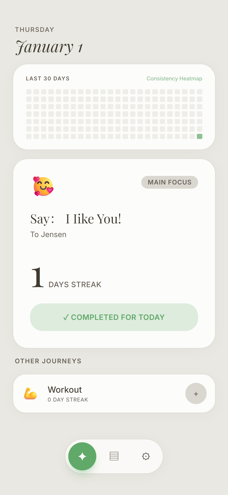
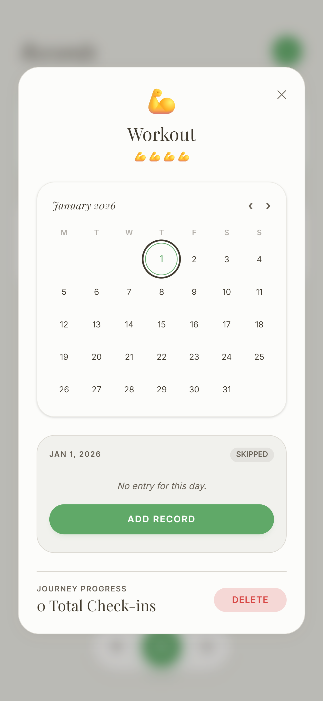
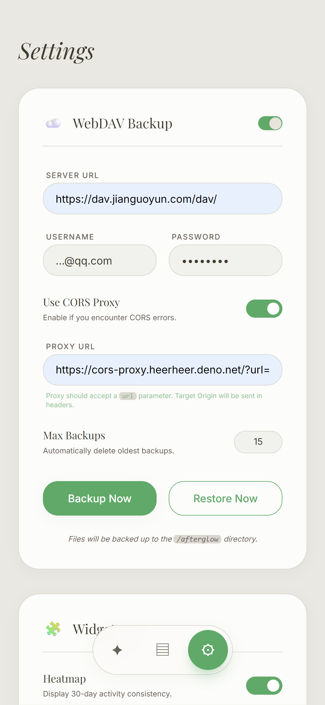
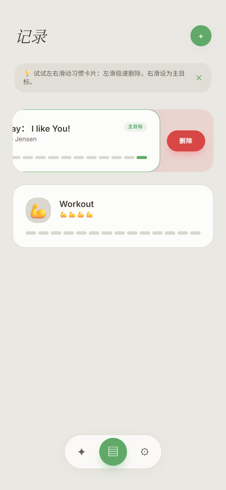

English | [简体中文](README_zh.md)

### Afterglow

Waiting for the settling, the lingering, and the fading, until it is a regret no more.

> 这首歌关于一个庆祝，庆祝什么呢，庆祝我们的遗憾，此时此刻我们是被我们过往所有的经历堆叠而成的，包括艰难的时刻，所以让我们点起火把。
>
> ———— 《当我们点起火把》

## UI

**Build with Gemini-3-Flash and Antigravity.**

  
  
  
  

## Features

### Record

#### 1. Check-in
- **Daily Reflection**: Capture your mood and thoughts with a brief note.
- **Visual Feedback**: Stay motivated with day streaks and completion indicators.
- **Main Focus**: Highlight your primary journey for the day to stay aligned with your long-term goals.

#### 2. Journey Management
- **Custom Habits**: Create and track multiple "Journeys"(records) with personalized icons and descriptions.
- **Swipe Actions**: Intuitively manage your records—swipe right to set a main goal, swipe left to delete.
- **Progress Tracking**: Visualize your consistency with heatmaps and detailed check-in history. (You could enable these widgets in the settings.)

### WebDAV Backup

Securely sync your journey data using your own WebDAV server (e.g., Nutstore, Nextcloud, Cloudreve).

You can use your own CORS-Proxy to bypass browser restrictions when connecting to certain WebDAV providers, or you can choose mine, which url is `https://cors-proxy.heerheer.deno.net/?url=`

- **Cloud Synchronization**: Backup your local data to the `/afterglow` directory on your WebDAV server with one click.
- **Snapshot Management**: View a list of historical backups and restore from any specific snapshot.
- **Auto-Cleanup**: Set a maximum number of backups to automatically manage storage and remove older versions.
- **CORS Proxy Support**: Built-in support for CORS proxies to bypass browser restrictions when connecting to certain WebDAV providers.
- **Quick Backup**: Accessible quick backup button in the navigation for instant data protection.(WIP)

### Share
WIP
### Supervision
WIP
## Roadmap

- [x] Record!
- [ ] Share!
- [ ] Supervision!

## Contributing
WIP

